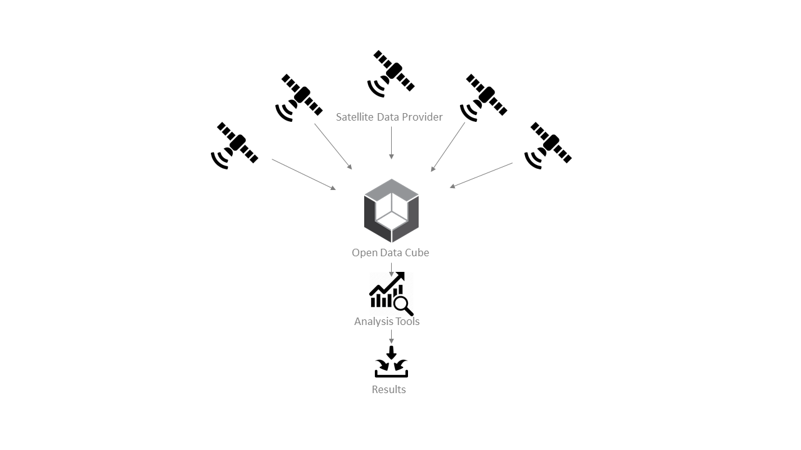
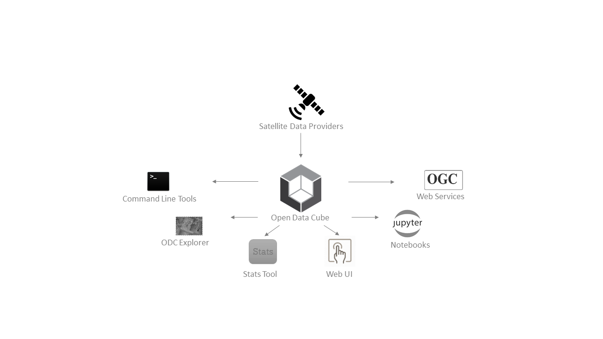
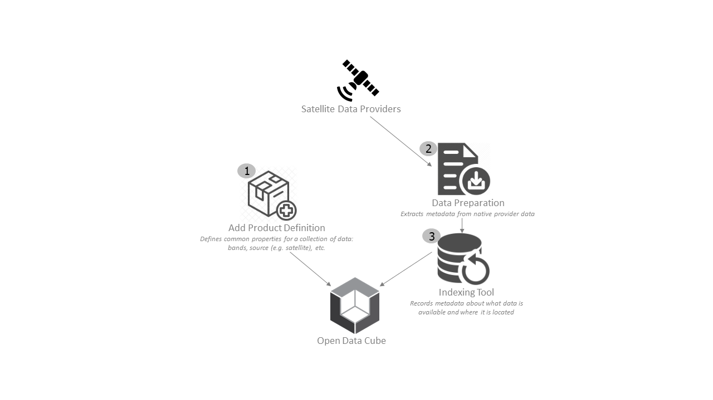
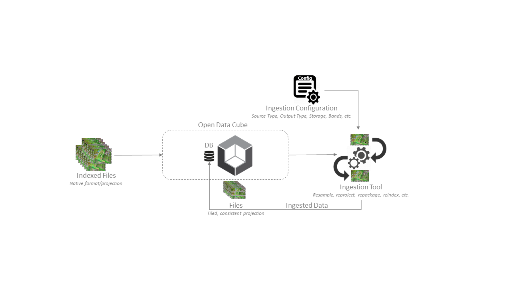
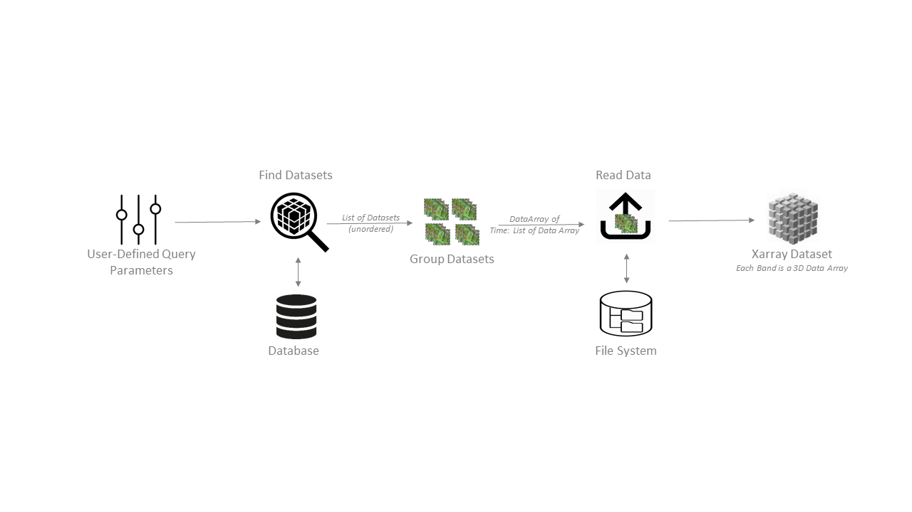

High Level Architecture
***********************

Summary 
=======

The Open Data Cube (ODC) is an open source solution for accessing, managing, and
analyzing large quantities of Geographic Information System (GIS) data - namely
Earth observation (EO) data. It presents a common analytical framework composed
of a series of data structures and tools which facilitate the organization and
analysis of large gridded data collections. The Open Data Cube was developed for
the analysis of temporally-rich earth observation data, however the flexibility
of the platform also allows other gridded data collections to be included and
analyzed. Such data may include elevation models, geophysical grids,
interpolated surfaces and model outputs. A key characteristic of the Open Data
Cube is that every unique observation is kept, which contrasts with many other
methods used to handle large gridded data collections. Some of the major
advantages of ODC are the following:

- Flexible framework

- User maintains control and ownership over their data

- Paradigm shift from scene-based analysis to pixel based

- Lower barrier to entry for remote sensing data analysis.

In this section, we briefly describe and illustrate the high-level architecture
and ecosystem of the ODC framework in order to provide a better understanding to
those who are new to ODC. This document only covers major components of the ODC
and the relationships between them.

High-Level ODC Overview
=======================

The ODC core serves as a layer between satellite data and end user applications.  
  
It provides a common analytical framework to allow multiple data sources to
produce information for multiple uses. The ODC can handle data from any
satellite data provider. The ODC eliminates the need for difficult and
time-consuming pre-processing of the data from individual applications. This
allows an increased capacity for development of information products by the
Earth Observation (EO) community, and increased value for the public from EO
information. :numref:`high-level-overview` illustrates data from many satellite data providers being
managed by an ODC system.

   High-Level Open Data Cube Overview

Several international space agencies provide data and make provisions to supply
this data in an Analysis Ready Data (ARD) format for immediate application.

:numref:`high-level-overview` illustrates a diverse set of data being managed by
an ODC core system. The ODC core system is then used as a simplified basis on
which end users conduct analysis using ODC compatible analysis tools.

High-Level ODC Ecosystem
========================  
  
As stated earlier, the ODC core serves as a layer between satellite data
providers and applications. A set of open source tools exist to help scientists
conduct research using data managed by the ODC.
  

:numref:`odc-ecosystem` illustrates popular tools used within the community that
utilizes the ODC Core as its basis:

* Command Line Tools: A tool used by programmers/developers to interface with
  the ODC.

* Open Data Cube Explorer: A visual and interactive web application that lets
  users explore their inventory of available data.

* Open Data Cube Stats: An optimized means of defining and executing advanced
  analysis on ODC system. This tool is oriented towards scientists.

* Web User Interface (UI): A web application that allows developers to
  interactively showcase and visualize the output of algorithms.

* Jupyter Notebooks: Research documents centered around techniques in EO
  sciences. A notebook contains executable code detailing examples of how the
  data cube is used in a research setting, and therefore is an invaluable
  reference material for new users.
 
* Open Geospatial Consortium (OGC) Web Services: Adapters that can connect non-ODC applications to the ODC.

   High-Level ODC Ecosystem

Download Data Locally and Index
===============================

In the previous section, :numref:`odc-ecosystem` showed that the ODC framework can make data
accessible to a sizeable ecosystem of applications. The following section
briefly covers a process called indexing. Described plainly, indexing is about
making the ODC aware of the existence of imagery. In the process of indexing
data, the ODC tracks information that is useful when it comes to loading
imagery, searching for imagery, or performing more advanced operations such as
realigning imagery. The data can be either downloaded locally or stored in the
cloud. In this section, we describe the process of indexing where data is
downloaded locally.

Here is a brief outline of the indexing process:

1. As shown in :numref:`download-and-index-data`, the first step in this process is to describe the
source of the imagery. We include basic details about which sensor the data
comes from, what format to expect the data in, as well as its measurements, e.g.
bands. This is done by drafting a document called a product definition for each
data type. This product definition is then added to the system. Adding a product
definition enables the system to accept that product.

2. The second step in the process is about extracting details from an individual
satellite image. This is called the data preparation step. Scripts are available
to extract information or metadata from many types of images.

3. The data extracted in step 2 typically includes date and time of acquisition,
spatial bounds, etc. as metadata. In the third step, called indexing, metadata
(documents) are indexed into the ODC’s database. Most importantly, the process
stores the location of the data within a local system.

   Download Data Locally and Index

Download Data Locally and Ingest
================================

In the previous section, we briefly touched on the process of indexing. In this
section, we will discuss the process called ingestion. Ingestion is a process
that takes indexed data and performs some operations to turn it into a new file
format or structure. This optimization step can increase the efficiency of data
storage and retrieval. For example, there are significant improvements when
converting downloaded GeoTIFFs to a format like NetCDF. Ingestion also splits
large scene files into several smaller tiles to help organize large
multidimensional data-sets for both fast and flexible data access. Geospatial
transformations can also be defined in the ingestion process. The ingestion
process can be configured using an ingestion configuration to reformat and apply
geospatial transforms to the data. :numref:`download-and-ingest` illustrates the ingestion process.
The indexed imagery is transformed and reformatted per ingestion configuration
specifications. It may involve re-sampling, re-projection, repackaging,
re-compression, etc. The newly formatted/transformed data is re-indexed in the
database under a new product name that gets registered in the database.

   Download Data Locally and Ingest

Load Data
=========  

User-supplied query parameters are used as a lookup into the metadata database
in order to determine which datasets hold data requested by the user. Those
datasets are then grouped and ordered, and the actual data is loaded from the
file system. The resulting data is organized into an Xarray Dataset with
appropriate temporal-spatial dimensions and separate data variables for each
band.

  
   Load Data
