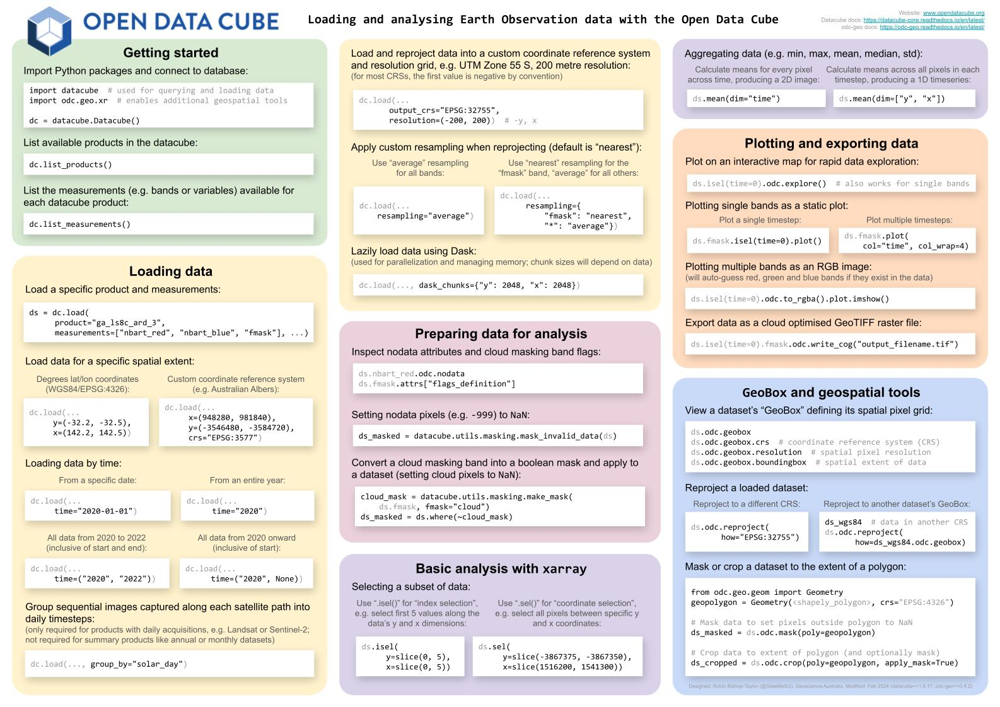

**********************
Data Access & Analysis
**********************

For users looking to access data from the Open Data Cube the simplest way to get started is to access a sandbox environment for your Open Data Cube of interest.
Once you have access to a sandbox environment you'll be able to start searching, loading and analysing data.

The Sandbox prepares a JupyterLab environment for you. All necessary software is provided as part of this environment, so no additional installation or configuration is required.

- `Digital Earth Australia Sandbox`_
- `Digital Earth Africa Sandbox`_

Alternatively, you can also use the `Cube In a Box`_ to setup an Open Data Cube instance locally using Docker.
This instance can be configured to index a selection Sentinel-2 level 2 data.

Open Data Cube Cheatsheet
#########################

To make it easier to get started with Open Data Cube, the following reference poster demonstrates how to perform common analysis tasks including loading data, data preparation, plotting and exporting, and geospatial manipulation:

.. _`Digital Earth Australia Sandbox`: https://www.dea.ga.gov.au/developers/sandbox
.. _`Digital Earth Africa Sandbox`: https://sandbox.digitalearth.africa/
.. _`Cube In a Box`: https://github.com/opendatacube/cube-in-a-box

.. toctree::
    :maxdepth: 4
    :caption: Data Access & Analysis

    apis/datacube-class.rst
    apis/product-discovery.ipynb
    apis/data-searching.ipynb
    apis/data-loading.ipynb

.. toctree::
    :maxdepth: 4
    :caption: Advanced Topics

    advanced-topics/virtual-products.rst
    advanced-topics/data-loading.rst

.. toctree::
    :maxdepth: 4
    :caption: Examples

    tools-exploring-data/using-juypter.rst
