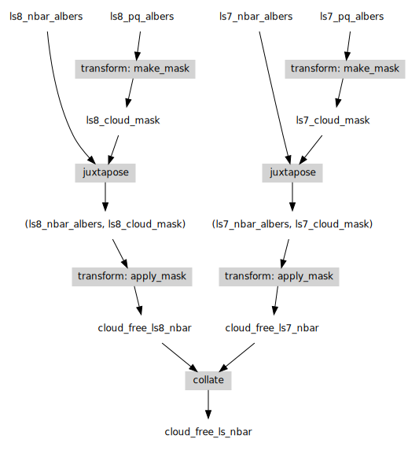
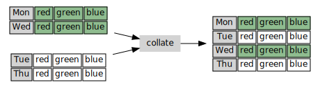
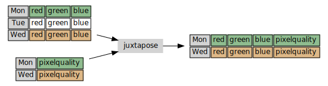
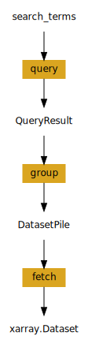

.. _virtual-products:

================
Virtual Products
================

Introduction
------------

Virtual products enable ODC users to declaratively combine data from multiple products and perform on-the-fly
computation while the data is loaded. The workflow is deduced from a lightweight configuration that can help datacube
optimize the query to avoid loading data that would be eventually discarded.

An example virtual product would be a cloud-free surface reflectance (SR) product derived from a base surface
reflectance product and a pixel quality (PQ) product that classifies cloud. Virtual products are especially useful
when the datasets from the different products have the same spatio-temporal extent and the operations are to be applied
pixel-by-pixel.

Functionalities related to virtual products are mainly in the :mod:`datacube.virtual` module.

Design
------

Currently, virtual products are constructed by applying a fixed set of combinators to either existing products or other
virtual products. That is, a virtual product can be viewed as a tree whose nodes are combinators and leaves are
ordinary datacube products.

Continuing the example in the previous section, consider the configuration (or the "recipe") for a cloud-free SR
product from SR products for two sensors (``ls7_nbar_albers`` and ``ls8_nbar_albers``) and their corresponding
PQ products (``ls7_pq_albers`` and ``ls8_pq_albers``):

.. code:: python

    from datacube.virtual import construct_from_yaml

    cloud_free_ls_nbar = construct_from_yaml("""
        collate:
          - transform: apply_mask
            mask_measurement_name: pixelquality
            input:
                juxtapose:
                  - product: ls7_nbar_albers
                    measurements: [red, green, blue]
                  - transform: make_mask
                    input:
                        product: ls7_pq_albers
                    flags:
                        blue_saturated: false
                        cloud_acca: no_cloud
                        cloud_fmask: no_cloud
                        cloud_shadow_acca: no_cloud_shadow
                        cloud_shadow_fmask: no_cloud_shadow
                        contiguous: true
                        green_saturated: false
                        nir_saturated: false
                        red_saturated: false
                        swir1_saturated: false
                        swir2_saturated: false
                    mask_measurement_name: pixelquality
          - transform: apply_mask
            mask_measurement_name: pixelquality
            input:
                juxtapose:
                  - product: ls8_nbar_albers
                    measurements: [red, green, blue]
                  - transform: make_mask
                    input:
                        product: ls8_pq_albers
                    flags:
                        blue_saturated: false
                        cloud_acca: no_cloud
                        cloud_fmask: no_cloud
                        cloud_shadow_acca: no_cloud_shadow
                        cloud_shadow_fmask: no_cloud_shadow
                        contiguous: true
                        green_saturated: false
                        nir_saturated: false
                        red_saturated: false
                        swir1_saturated: false
                        swir2_saturated: false
                    mask_measurement_name: pixelquality
        """)

The virtual product ``cloud_free_ls_nbar`` can now be used to load cloud-free SR imagery. The dataflow for loading the
data reflects the tree structure of the recipe:

Grammar
-------

Currently, there are four combinators for creating virtual products:

1. ``product``
~~~~~~~~~~~~~~

The recipe to construct a virtual product from an existing datacube product has the form:

.. code-block:: text

    {'product': <product-name>, **settings}

where ``settings`` can include :meth:`datacube.Datacube.load` settings such as:

- ``measurements``
- ``output_crs``, ``resolution``, ``align``
- ``resampling``
- ``group_by``, ``fuse_func``

The ``product`` nodes are at the leaves of the virtual product syntax tree.

2. ``collate``
~~~~~~~~~~~~~~

This combinator concatenates observations from multiple sensors having the same set of measurements. The recipe
for a ``collate`` node has the form:

.. code-block:: text

    {'collate': [<virtual-product-1>,
                 <virtual-product-2>,
                 ...,
                 <virtual-product-N>]}

Observations from different sensors get interlaced:

Optionally, the source product of a pixel can be captured by introducing another measurement in the loaded data
that consists of the index of the source product:

.. code-block:: text

    {'collate': [<virtual-product-1>,
                 <virtual-product-2>,
                 ...,
                 <virtual-product-N>],
     'index_measurement_name': <measurement-name>}

3. ``transform``
~~~~~~~~~~~~~~~~

This node applies an on-the-fly data transformation on the loaded data. The recipe for a ``transform`` has the form:

.. code-block:: text

    {'transform': <transformation-class>,
     'input': <input-virtual-product>,
     **settings}

where the ``settings`` are keyword arguments to the initializer of the transformation class that implements the
``datacube.virtual.Transformation`` interface:

.. code:: python

   class Transformation:
       def __init__(self, **settings):
           """ Initialize the transformation object with the given settings. """

       def compute(self, data):
           """ xarray.Dataset -> xarray.Dataset """

       def measurements(self, input_measurements):
           """ Dict[str, Measurement] -> Dict[str, Measurement] """

ODC has a (growing) set of built-in transformations:

- ``make_mask``
- ``apply_mask``
- ``to_float``
- ``rename``
- ``select``
- ``formula``

For more information on transformations, see :ref:`user-defined-virtual-product-transforms`.

4. ``juxtapose``
~~~~~~~~~~~~~~~~

This node merges disjoint sets of measurements from different products into one.
The form of the recipe is:

.. code-block:: text

    {'juxtapose': [<virtual-product-1>,
                   <virtual-product-2>,
                   ...,
                   <virtual-product-N>]}

Observations without corresponding entries in the other products will get dropped.

Using virtual products
----------------------

Virtual products provide a common interface to query and then to load the data. The relevant methods are:

    ``query(dc, **search_terms)``
        Retrieves datasets that match the ``search_terms`` from the database index of the datacube instance ``dc``.

    ``group(datasets, **search_terms)``
        Groups the datasets from ``query`` by the timestamps, and optionally restricts the region of interest. Does not
        connect to the database.
        
    ``fetch(grouped, **load_settings)``
        Loads the data from the grouped datasets according to ``load_settings``. Does not connect to the database. The
        on-the-fly transformations are applied at this stage. The ``resampling`` method or ``dask_chunks`` size can be
        specified in the ``load_settings``.

Currently, virtual products also provide a ``load(dc, **query)`` method that roughly correspond to ``dc.load``.
However, this method exists only to facilitate code migration, and its extensive use is not recommended. It implements
the pipeline:

For advanced use cases, the intermediate objects ``VirtualDatasetBag`` and ``VirtualDatasetBox`` may be directly manipulated.

.. _user-defined-virtual-product-transforms:

User-defined transformations
----------------------------

Custom transformations must inherit from :class:`datacube.virtual.Transformation`. If the user-defined transformation class
is already installed in the Python environment the datacube instance is running from, the recipe may refer to it by its
fully qualified name. Otherwise, for example for a transformation defined in a Notebook, the virtual product using the
custom transformation is best constructed using the combinators directly.

For example, calculating the NDVI from a SR product (say, ``ls8_nbar_albers``) would look like:

.. code-block:: python

    from datacube.virtual import construct, Transformation, Measurement

    class NDVI(Transformation):
        def compute(self, data):
            result = ((data.nir - data.red) / (data.nir + data.red))
            return result.to_dataset(name='NDVI')

        def measurements(self, input_measurements):
            return {'NDVI': Measurement(name='NDVI', dtype='float32', nodata=float('nan'), units='1')}

    ndvi = construct(transform=NDVI, input=dict(product='ls8_nbar_albers', measurements=['red', 'nir'])

    ndvi_data = ndvi.load(dc, **search_terms)

for the required geo-spatial ``search_terms``. Note that the ``measurement`` method describes the output from
the ``compute`` method.

.. note::
    We assume that the user-defined transformations are dask-friendly, otherwise loading data using dask may
    be broken. Also, method names starting with ``_transform_`` are reserved for internal use.
