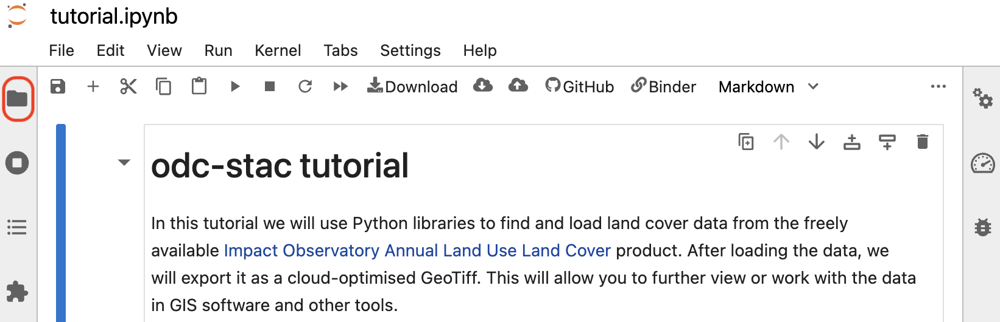
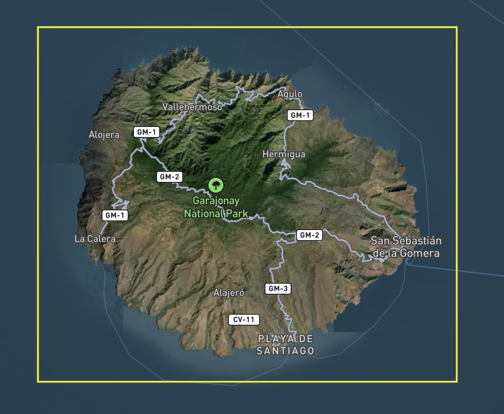
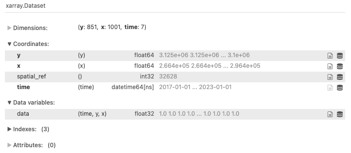
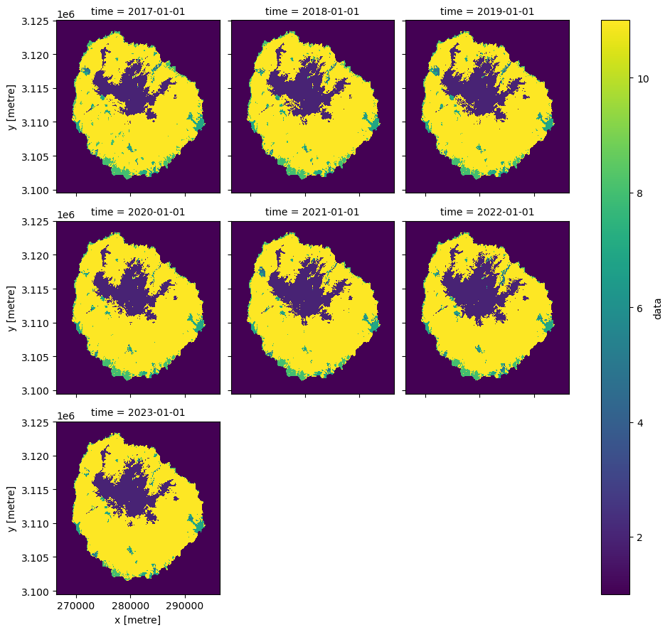

****************************
Accessing data with odc-stac
****************************

Introduction
============

In this tutorial we will use Python libraries to find and load Land Use and Land Cover data from the freely available `Impact Observatory Annual Land Use Land Cover <https://planetarycomputer.microsoft.com/dataset/io-lulc-annual-v02>`_ product.
After loading the data, we will export each year of data as a `Cloud Optimised GeoTIFF <https://cogeo.org/>`_.
This will allow you to further view or work with the data in GIS software and other tools.

During the tutorial, we will:

* Specify our search in terms of:
  
  * what (data provider and product)
  * where (area of interest)
  * when (date range)
* Use :ref:`pystac-client` to connect to a `Spatio-Temporal Asset Catalog (STAC) <https://stacspec.org/en>`_ 
  endpoint and search for data matching our what, where, and when
* Use :ref:`odc-stac` to load the matching data into memory
* Visualise and export the data

There is no need to install anything.
This tutorial runs in an online environment that we have prepared for you. 

Launch tutorial environment
===========================

Right-click on the Binder button below and select "Open Link in New Window" to launch the tutorial environment.
This will allow you to keep the tutorial instructions open alongside the environment.

The tutorial environment may take a few minutes to start.

.. image:: https://mybinder.org/badge_logo.svg
 :target: https://mybinder.org/v2/gh/opendatacube/tutorials/main?urlpath=%2Fdoc%2Ftree%2Fodc-stac%2Ftutorial.ipynb
 :width: 240px
 :align: center

| Once launched, you should see a Jupyter notebook environment with the tutorial notebook open. The tutorial notebook has headers that match up with the tutorial instructions on this page.

| We also recommend that you open the file browser by clicking the folder icon on the left-hand menu bar (circled in red in the top-left of the image above). This will allow you to see the output files at the end of the tutorial.

.. note::
   For this tutorial, we believe you will learn more if you type the code yourself, rather than using copy-paste.
   Typing encourages you to slow down and think about what you're doing, which will help you gain understanding!

   If you are stuck at any point, open the :file:`tutorial_solution.ipynb` notebook that is available in the file browser.

Tutorial
========

Python imports
--------------

The notebook requires five libraries to run:

* `geopandas`_ for loading an area of interest from a GeoJSON file
* :code:`odc.geo` for exporting loaded data
* :code:`odc.stac` for loading data
* :code:`planetary_computer` to provide authentication when accessing data
* :code:`pystac-client` for querying catalogs of data

We will import either the library, or specific functions and classes from the library.
Type the following into the empty cell below the **Python imports** heading:

.. code-block:: python

   import geopandas as gpd
   from odc.geo.xr import write_cog
   from odc.stac import load
   import planetary_computer
   from pystac_client import Client

When you have finished, run the cell by pressing :kbd:`Shift+Enter` on your keyboard.
   
Set up query parameters
-----------------------

In this section of the tutorial, you will specify:

* The area you want to load data for
* The date range you want to load data for
* The data source you want to load from

Area of interest
^^^^^^^^^^^^^^^^

We specify the area of interest using the :file:`aoi.geojson` file, which can be loaded with :code:`geopandas`.

The area of interest is the island of `La Gomera <https://en.wikipedia.org/wiki/La_Gomera>`_, one of the `Canary Islands <https://en.wikipedia.org/wiki/Canary_Islands>`_.

| Type the following into the empty cell below the **Area of interest** heading:

.. code-block:: python

   desired_aoi = gpd.read_file("aoi.geojson")
   desired_aoi_geometry = desired_aoi.iloc[0].geometry

When you have finished, run the cell by pressing :kbd:`Shift+Enter` on your keyboard.

Date range
^^^^^^^^^^

We must specify a start and end date for our query.
Type the following into the empty cell below the **Date range** heading:

.. code-block:: python

   desired_start_date = "2017-01-01"
   desired_end_date = "2023-01-01"
   desired_date_range = (desired_start_date, desired_end_date)

When you have finished, run the cell by pressing :kbd:`Shift+Enter` on your keyboard.

STAC metadata
^^^^^^^^^^^^^

Many Earth observation data providers generate STAC metadata, which can be used to find and load data you're interested in.
STAC metadata has four important components:

* **Catalog**: A structure for organising multiple datasets managed by a given provider. For example, `Planetary Computer's Catalog <https://radiantearth.github.io/stac-browser/#/external/planetarycomputer.microsoft.com/api/stac/v1/>`_
* **Collection**: A structure for organising all items in a single dataset. For example, `Land Use Land Cover Collection <https://radiantearth.github.io/stac-browser/#/external/planetarycomputer.microsoft.com/api/stac/v1/collections/io-lulc-annual-v02>`_
* **Item** A single spatio-temporal item, such as one observation in a dataset. For example, `Land Use Land Cover Data for Supercell 28R in 2023 <https://radiantearth.github.io/stac-browser/#/external/planetarycomputer.microsoft.com/api/stac/v1/collections/io-lulc-annual-v02/items/28R-2023>`_
* **Asset** A single data measurement associated with an item, such as a single band. The Land Use Land Cover Dataset has only one asset, called "data".

We must specify the URL for the catalog we want to search, along with the desired collection (:code:`io-lulc-annual-v02`) and asset (:code:`data`). 
The precise items that we need to load will be returned by a query that we run later.

Type the following into the empty cell below the **STAC metadata** heading:

.. code-block:: python

   catalog_url = "https://planetarycomputer.microsoft.com/api/stac/v1/"
   desired_collections = ["io-lulc-annual-v02"]
   desired_assets = ["data"]

When you have finished, run the cell by pressing :kbd:`Shift+Enter` on your keyboard.

Connect to catalog and find items
---------------------------------

We use :code:`pystac-client`'s :code:`Client` class to connect to Planetary Computer's STAC catalog.
We also use :code:`planetary_computer.sign_inplace` to authorise our connection.
Type the following into the empty cell below the **Connect to catalog and find items** heading:

.. code-block:: python

   stac_client = Client.open(
      url=catalog_url, 
      modifier=planetary_computer.sign_inplace,
   )

When you have finished, run the cell by pressing :kbd:`Shift+Enter` on your keyboard.

Search for items
^^^^^^^^^^^^^^^^

After setting up the :code:`Client`, we use the :code:`search` method to find items that match our chosen collection, area of interest, and date range.
Type the following into the empty cell below the **Search for items** heading:

.. code-block:: python

   items = stac_client.search(
       collections=desired_collections,
       intersects=desired_aoi_geometry,
       datetime=desired_date_range,
   ).item_collection()

   print(f"Found {len(items)} items")

When you have finished, run the cell by pressing :kbd:`Shift+Enter` on your keyboard.
After running the cell, you should see a printed sentence reporting "Found 7 items"

Troubleshooting
"""""""""""""""

If the sentence shows a different number of items, try checking whether your :code:`desired_date_range` parameter is correct by printing it:

.. code-block:: python

   print(desired_date_range)

should return :code:`('2017-01-01', '2023-01-01')`.
If you see a different date range, return to the **Set up query parameters - Date range** section and ensure your :code:`desired_start_date` and :code:`desired_end_date` values match those given in the instructions.

Load items with odc-stac
------------------------

After producing a list of items to load, we can use the :code:`load` function from :code:`odc-stac` to read the requested assets from the items and return them as xarrays.

Type the following into the empty cell below the **Load items with odc-stac** heading:

.. code-block:: python

   ds = load(
      items=items,
      bands=desired_assets,
      geopolygon=aoi_geometry,
      crs="utm",
      resolution=30
   )

   ds

When you have finished, run the cell by pressing :kbd:`Shift+Enter` on your keyboard.

After running the cell, you should see a :code:`xarray.Dataset` summary.

Visualise loaded data
---------------------

To confirm that we have loaded the requested data, it is useful to visualise it. 
We can use :code:`xarray`'s built-in plotting functionality to make a basic plot.

Type the following into the empty cell below the **Visualise loaded data** heading:

.. code-block:: python

   ds["data"].plot.imshow(col="time", col_wrap=3)

When you have finished, run the cell by pressing :kbd:`Shift+Enter` on your keyboard.
After running the cell, you should see the following visualisation.
The colours in the plot represent the following land cover classes:

- dark blue: water
- green: built area
- yellow: rangeland
- mid blue: trees

Advanced visualisation
^^^^^^^^^^^^^^^^^^^^^^

The code we've used provides us a visualisation that allows us to check that the data loaded successfully.

To produce a more descriptive plot, we recommend reviewing the `example notebook <https://planetarycomputer.microsoft.com/dataset/io-lulc-annual-v02#Example-Notebook>`_ that Microsoft Planetary Computer provide for this dataset.

Export loaded data
------------------

Once you have loaded and checked your data, it is often useful to export it.
This allows you to use the data in other software and analyses.
The :code:`odc-geo` library provides the :code:`write_cog` function to generate and write these files from an :code:`xarray`.

The code below extracts the year of each image from the dataset, then uses a loop to export each dataset to a new file.

Type the following into the empty cell below the **Export loaded data** heading:

.. code-block:: python

   years = ds.time.dt.strftime("%Y").values

   for timestep in range(len(ds.time)):
   
       ds_single_year = ds["data"].isel(time=timestep)
       
       write_cog(
           ds_single_year,
           f"LULC_{years[timestep]}.tif", 
           overwrite=True,
       )

When you have finished, run the cell by pressing :kbd:`Shift+Enter` on your keyboard.
You should see seven new files in the file browser, starting with :file:`LULC_2017.tif` and ending with :file:`LULC_2023.tif`.

Tutorial complete!
------------------

Congratulations, you've used :code:`pystac-client` to search for data in a public STAC catalog and :code:`odc-stac` to load the data into an :code:`xarray`.
In the last step you exported the loaded data as a series of Cloud Optimised GeoTIFF files, which you can now use in other applications.

.. note::
   Make sure you download these files from the file browser before exiting the tutorial space as they will be deleted when the tutorial space is closed.

   To download, open the file-browser by clicking the folder icon in the left menu bar.
   Then, download the Land Use Land Cover file for each year (denoted as :file:`LULC_{year}.tif`) by right-clicking each file and selecting :guilabel:`Download`.
